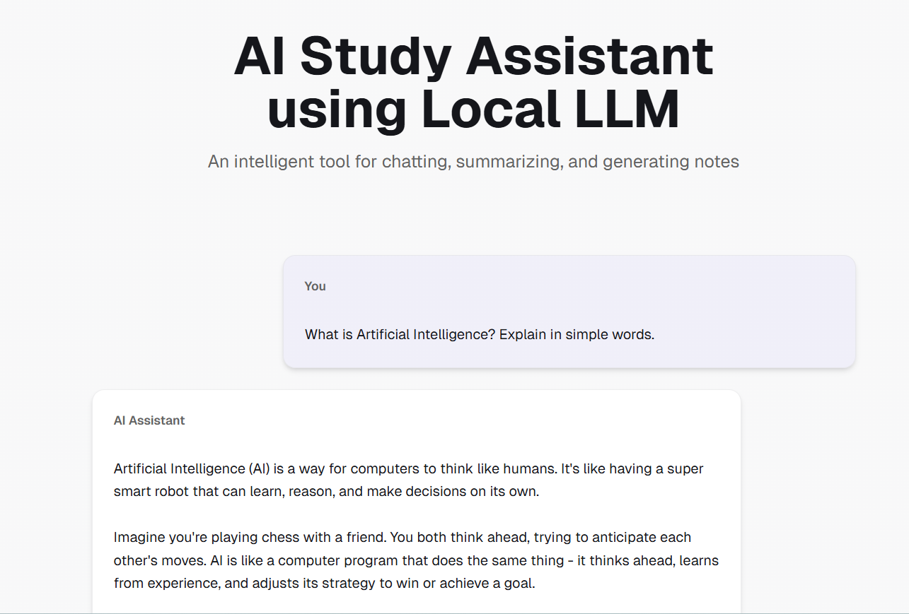
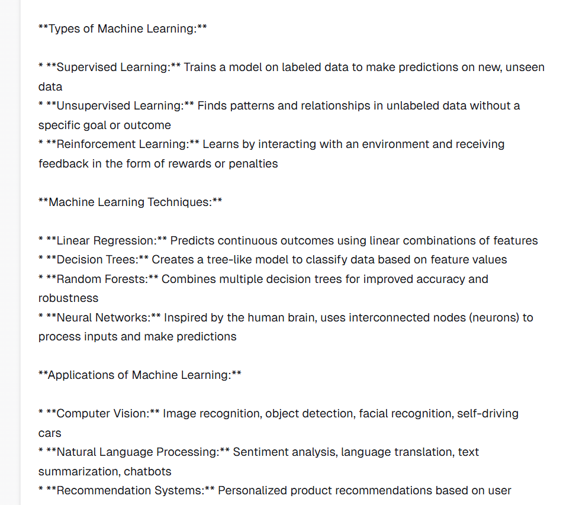
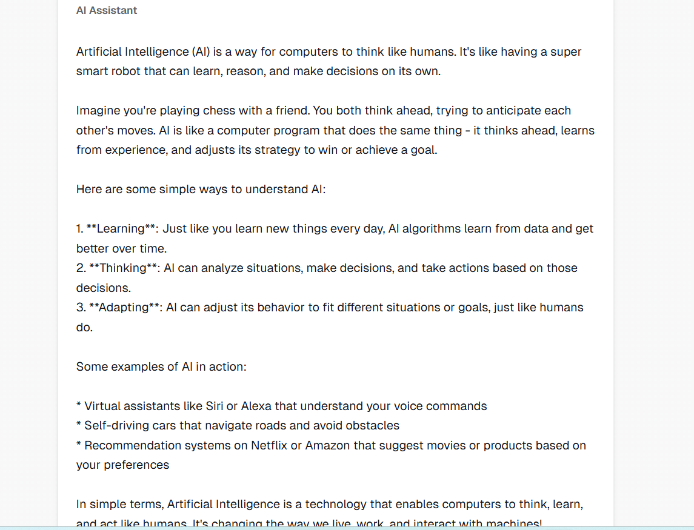
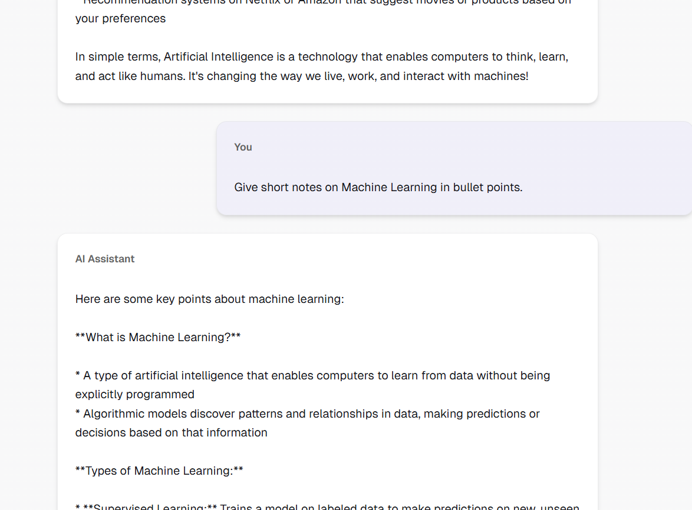
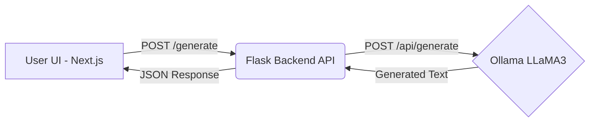

# AI Study Assistant






This is a modern web application built with [Next.js](https://nextjs.org/), React 19, Tailwind CSS, and Radix UI components, designed to act as an intelligent, responsive study companion.

## Key Features
- **Continuous Chat Interface:** Supports multiple prompts and a scrollable chat history, identical to ChatGPT.
- **Local LLM Connect:** Connects securely to a running local Ollama instance (LLaMA3) via a Python Flask API backend.
- **Smart Formatting:** Correctly renders AI-generated paragraphs, line breaks, bullet points, and structure.

## System Architecture & Workflow

The application follows a clean, decoupled 3-tier architecture:

1. **Frontend (Next.js / React)**
   - Manages the user interface, chat history state, and user inputs dynamically.
   - Sends asynchronous HTTP POST requests via the `fetch` API to our local Python server.
2. **Backend API Bridge (Flask)**
   - A lightweight Python server (`backend/app.py`) running locally on port 5000.
   - Listens for `/generate` requests, handles CORS securely, shapes the data, and manages request timeouts before forwarding the prompt to the LLM.
3. **Local LLM Engine (Ollama)**
   - The heavy lifting. Runs the 8-Billion parameter `llama3` model straight on your hardware.
   - Processes the prompt and returns the natively generated intelligence back through the Flask bridge to the UI.

**Visual Architecture & Workflow Diagram:** 



## File Structure

```text
llmproject/
├── app/
│   ├── page.tsx          # Main UI containing the dynamic Chat Component
│   ├── layout.tsx        # Global app layout
│   └── globals.css       # Global styles (Tailwind integration)
├── backend/
│   └── app.py            # Python Flask server acting as the secure Ollama bridge
├── components/           # Reusable UI elements (Buttons, Textareas, Cards)
├── public/               # Static assets, including app screenshots
├── tailwind.config.ts    # Tailwind CSS design configurations
└── package.json          # Node.js frontend dependencies
```

## Prerequisites

Before you begin, ensure you have the following installed on your machine:
- [Node.js](https://nodejs.org/) (v18 or higher recommended)
- [pnpm](https://pnpm.io/) (Package manager used for this project)
- [Python 3.x](https://www.python.org/)
- [Ollama](https://ollama.ai/) with the `llama3` model pulled to your system (`ollama run llama3`)

## Getting Started

Follow these steps to spin up the complete project stack locally:

### 1. Start the Frontend UI
Open your terminal in the project directory and run:
```bash
pnpm install
pnpm dev
```
The beautiful UI will be available at [http://localhost:3000](http://localhost:3000).

### 2. Start the Backend API (Flask)
Open a new terminal, navigate to the project directory, and install the required Python packages:
```bash
pip install flask flask-cors requests
```
Next, boot up the Flask server:
```bash
python backend/app.py
```
The backend will boot up on `http://localhost:5000` and is ready to bridge generation requests.

### 3. Start the LLM Engine (Ollama)
Finally, ensure the Ollama agent is actively running locally on your hardware. Boot it up in a brand new terminal window:
```bash
ollama run llama3
```

---

## Final Notes
You now have a powerful, completely locally-hosted AI assistant! Because everything runs exclusively on your own machine (from the Next.js frontend to the Flask backend and Ollama engine), **your data remains 100% private and secure** without relying on pricey third-party cloud AI vendors. Have fun chatting, summarizing, and studying!
